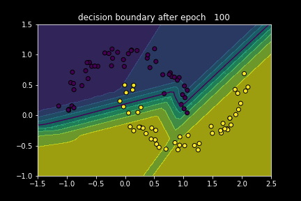

# object-oriented-NN

Simple fully-connected neural network for binary point classification. Like [simple-NN](https://github.com/julian-q/simple-NN) but with classes, meaning the code is decomposed much better! Built from scratch with NumPy.
